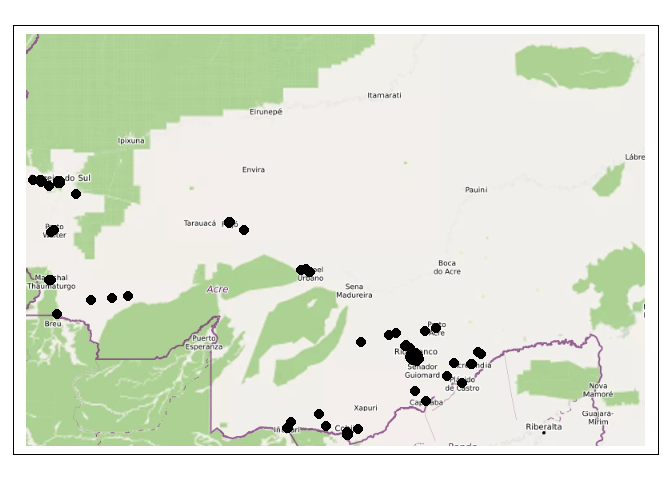

# geocodepro

Disponibiliza funções que facilitam a utilização da ferramenta de
geolocalização do ArcGIS Pro no R.

## Instalação

**geocodepro** não está no CRAN, e provavelmente nem vai estar no
futuro. Pra instalar o pacote, use o código abaixo:

``` r
# install.packages("remotes")
remotes::install_github("ipeaGIT/geocodepro")
```

O pacote também precisa de uma licença válida e ativa do ArcGIS Pro na
máquina em que o código está sendo rodado.

## Utilização

O **geocodepro** funciona através da interface entre o ArcGIS Pro e a
linguage de programação Python. Para isso, ele utiliza a biblioteca
`arcpy` através do pacote `{reticulate}`. É necessário que nós
utilizemos a mesma versão e as mesmas bibliotecas de Python que o ArcGIS
Pro usa, portanto para isso nós precisamos apontar para o ambiente de
programação do ArcGIS com a função `use_condaenv()` do `{reticulate}`
(isso pode ser feito tanto antes quanto depois de carregar o
**geocodepro**, mas deve ser feito antes de utilizar suas funções).

``` r
reticulate::use_condaenv(
  "C://Program Files/ArcGIS/Pro/bin/Python/envs/arcgispro-py3"
)
```

Antes de utilizarmos o pacote, precisamos primeiro aponta o ambiente de
trabalho adequado pra isso A principal função do pacote é a `geocode()`.
Ela tem como principais *inputs* uma tabela de endereços e um arquivo
que aponta para o localizador utilizado pela ferramenta para fazer a
correspondência com os endereços. É necessário também indicar quais
colunas da tabela correspondem a cada um dos campos de geolocalização
utilizados pelo ArcGIS Pro, o que fazemos com a função
`address_fields_const()`. No exemplo abaixo, geolocalizamos os 1000
primeiros registros do CNES 2022.

``` r
library(geocodepro)

cnes <- readxl::read_xlsx(
  "../../data-raw/cnes/2022/BANCO_ESTAB_IPEA_COMP_08_2022_DT_25_10_2023.xlsx",
  skip = 15,
  n_max = 1000
) |>
  dplyr::mutate(LOGRADOURO = paste(LOGRADOURO, NUMERO)) |>
  dplyr::select(UF, MUNICÍPIO, LOGRADOURO, BAIRRO, CEP)

ends_geolocalizados <- geocode(
  cnes,
  locator = "../../data-raw/locators/BRA/BRA.loc",
  address_fields = address_fields_const(
    Address_or_Place = "LOGRADOURO",
    Neighborhood = "BAIRRO",
    City = "MUNICÍPIO",
    State = "UF",
    ZIP = "CEP"
  )
)
ends_geolocalizados
#> Simple feature collection with 1000 features and 10 fields
#> Geometry type: POINT
#> Dimension:     XY
#> Bounding box:  xmin: -73.02722 ymin: -11.03221 xmax: -66.92891 ymax: -7.592121
#> Geodetic CRS:  WGS 84
#> First 10 features:
#>    Status Score Match_type                                             Match_addr     Addr_type UF    MUNICÍPIO
#> 1       M 91.86          A           Rua Sete Quedas, Acrelândia, Acre, 69945-000    StreetName AC   ACRELANDIA
#> 2       M 85.83          A                    BR-364, Acrelândia, Acre, 69945-000    StreetName AC   ACRELANDIA
#> 3       M 84.50          A                                              69945-000     PostalExt AC   ACRELANDIA
#> 4       M 98.57          A        Avenida Paraná 346, Acrelândia, Acre, 69945-000 StreetAddress AC   ACRELANDIA
#> 5       M 98.57          A        Avenida Brasil 591, Acrelândia, Acre, 69945-000 StreetAddress AC   ACRELANDIA
#> 6       M 98.70          A   Rua Geraldo Barbosa 385, Acrelândia, Acre, 69945-000 StreetAddress AC   ACRELANDIA
#> 7       M 98.70          A   Rua Geraldo Barbosa 296, Acrelândia, Acre, 69945-000 StreetAddress AC   ACRELANDIA
#> 8       M 96.81          A   Rua Geraldo Barbosa 286, Acrelândia, Acre, 69945-000 StreetAddress AC   ACRELANDIA
#> 9       M 84.50          A                                              69945-000     PostalExt AC   ACRELANDIA
#> 10      M 91.92          A Rua João José do Bonfim, Assis Brasil, Acre, 69935-000    StreetName AC ASSIS BRASIL
#>                     LOGRADOURO     BAIRRO      CEP                       Shape
#> 1         RUA SETE QUEDAS 1396     CENTRO 69945000 POINT (-67.04542 -10.07633)
#> 2            BR 364 KM 114 114 ZONA RURAL 69945000 POINT (-66.96392 -9.921225)
#> 3     AC 475 VILA REDENCAOI NA ZONA RURAL 69945000 POINT (-66.92891 -9.937881)
#> 4           AVENIDA PARANA 346     CENTRO 69945000 POINT (-67.05574 -10.07704)
#> 5           AVENIDA BRASIL 591     CENTRO 69945000 POINT (-67.05339 -10.07756)
#> 6      RUA GERALDO BARBOSA 385     CENTRO 69945000 POINT (-67.05257 -10.07724)
#> 7      RUA GERALDO BARBOSA 296     CENTRO 69945000 POINT (-67.05181 -10.07754)
#> 8  AVENIDA GERALDO BARBOSA 286     CENTRO 69945000 POINT (-67.05173 -10.07755)
#> 9     AVENIDA EDMUNDO PINTO 36     CENTRO 69945000 POINT (-66.92891 -9.937881)
#> 10 RUA JOAO JOSE DO BONFIM 140 BELA VISTA 69935000 POINT (-69.55768 -10.93841)
```

``` r
library(tmap)

tiles <- maptiles::get_tiles(
  ends_geolocalizados,
  provider = "OpenStreetMap.France"
)

tm_shape(tiles) +
  tm_rgb() +
  tm_shape(ends_geolocalizados) +
  tm_dots(col = "black", size = 0.5)
```


